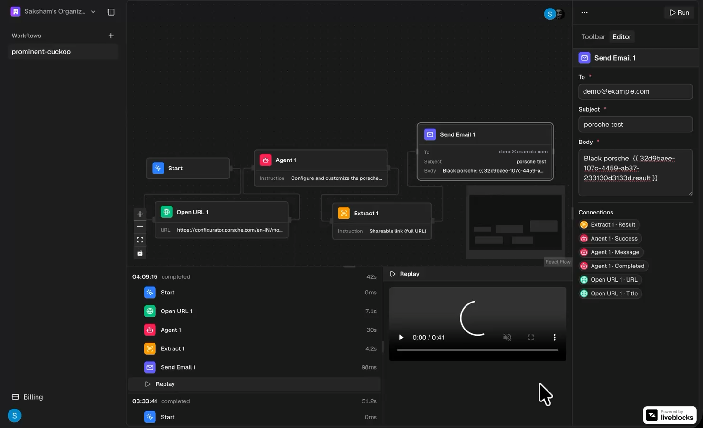

<div align="center">


# Brovio.cc

### Automate the web on a canvas, run it on real cloud browsers.

Drag nodes onto a canvas to open pages, act on them, observe them, and extract
structured data. Connect them, press **Run**, and watch every step execute live —
with a full session replay when it finishes.

<br />

[](LICENSE)
[](content/docs/self-hosting.md)
[](CONTRIBUTING.md)

<br />


<br />

[**Live app**](https://brovio.cc) · [**Self-hosting guide**](content/docs/self-hosting.md) · [**Docs**](#-documentation) · [**Contributing**](CONTRIBUTING.md)

</div>

<br />

## Demo

<div align="center">

<a href="https://brovio.cc">
  
</a>

<sub>▶︎ <b><a href="https://brovio.cc">Try it live</a></b> — build a workflow and watch it run</sub>

</div>

<!--
  The demo .mp4 is not in the repo: it is ~196 MB, over GitHub's 100 MB file
  limit, so public/videos/*.mp4 is gitignored.

  To play it inline here: drag the .mp4 into a GitHub issue comment or a
  release, copy the https://github.com/user-attachments/assets/... URL it hands
  back, and paste that URL on its own line below. GitHub renders video only from
  its own CDN — a relative repo path will not play.
-->

<br />

## The canvas


<table>
<tr>
<td width="50%"><br /><sub><b>Configure a node</b> — every field can read values from earlier steps.</sub></td>
<td width="50%"><br /><sub><b>Read every step</b> — logs and structured output under the canvas.</sub></td>
</tr>
</table>

<br />

## Nodes

| | Node | What it does |
|---|---|---|
| 🔵 | **Start** | Kicks off the run. Every workflow begins here. |
| 🟢 | **Open URL** | Navigates the cloud browser to a page. |
| 🟣 | **Act** | Performs one atomic action — click, type, select. |
| 🟡 | **Extract** | Pulls structured data off the page against a schema. |
| 🔷 | **Observe** | Inspects what is on the page before acting on it. |
| 🔴 | **Agent** | Hands a goal to an AI agent and lets it drive. |
| 🟦 | **Send Email** | Delivers the result when the run finishes. |

Every node publishes named outputs. Write `{{ nodeId.title }}` in a later node's
field and the value flows straight through when the run reaches it.

Full reference: **[Nodes](content/docs/nodes.md)**.

<br />

## Two ways to run it

<table>
<tr>
<td width="50%">

### ☁️ Hosted

Subscribe and we run it for you.
Nothing to install, nothing to configure.

[**Start automating →**](https://brovio.cc)

</td>
<td width="50%">

### 🖥️ Self-hosted

The same application, run by you, **free**.
No feature gates, no limits, no subscription.

[**Self-hosting guide →**](content/docs/self-hosting.md)

</td>
</tr>
</table>

<br />

## Quickstart (self-hosting)

You need Docker, and free accounts with Clerk, Liveblocks, Browserbase, and
Trigger.dev. Postgres is included — no database provider needed.

```bash
git clone https://github.com/saksham-dev0/browser-automation.git
cd browser-automation
./scripts/setup.sh
```

The script tells you what is missing, creates your `.env`, builds and starts
everything, makes it survive reboots, and deploys the workflow tasks. Run it
again any time — after pulling new code, or just to check on things.

Full walkthrough from a bare machine, including installing Docker and where each
key comes from: **[self-hosting guide](content/docs/self-hosting.md)**.

> [!IMPORTANT]
> One step is not just an environment variable: Trigger.dev needs your own
> project reference in `trigger.config.ts`. Workflow runs fail without it.
> See [Trigger.dev setup](content/docs/trigger-dev.md).

Upgrading:

```bash
git pull
./scripts/setup.sh
```

<br />

## Services you need accounts for

Self-hosting is not dependency-free. Clerk, Liveblocks, and Browserbase cannot
be self-hosted, though each has a free tier. Trigger.dev can be self-hosted or
used via their cloud. Postgres runs in the Compose stack.

| Service | Used for | Self-hostable |
|---|---|---|
| [Clerk](https://clerk.com) | Auth and organizations | No — free tier |
| [Liveblocks](https://liveblocks.io) | Multiplayer canvas | No — free tier |
| [Browserbase](https://browserbase.com) | Cloud browsers and replays | No — free tier |
| [Trigger.dev](https://trigger.dev) | Background workflow runs | Yes, or cloud |
| Postgres | Workflows, runs, results | Yes — in Compose |

Full list with signup links:
**[environment variables](content/docs/environment-variables.md)**.

<br />

## Built with

**[Next.js 16](https://nextjs.org)** (App Router) · **[React 19](https://react.dev)** ·
**[Drizzle ORM](https://orm.drizzle.team)** on Postgres ·
**[Clerk](https://clerk.com)** for auth and organizations ·
**[Trigger.dev](https://trigger.dev)** for background runs ·
**[Liveblocks](https://liveblocks.io)** for the multiplayer canvas ·
**[React Flow](https://reactflow.dev)** for the canvas itself ·
**[Stagehand](https://docs.stagehand.dev)** on **[Browserbase](https://browserbase.com)** for the browser work.

<br />

## 📚 Documentation

| Guide | What is in it |
|---|---|
| [Self-hosting](content/docs/self-hosting.md) | Bare machine to running app |
| [Trigger.dev setup](content/docs/trigger-dev.md) | The one step that is not an env var |
| [Environment variables](content/docs/environment-variables.md) | Every key, and where to get it |
| [Nodes](content/docs/nodes.md) | What each node does and outputs |
| [Architecture](content/docs/architecture.md) | How a run actually executes |

<br />

## Contributing

Issues and pull requests are welcome. See **[CONTRIBUTING.md](CONTRIBUTING.md)**.

<br />

## License

**AGPL-3.0.** You may run, modify, and self-host this freely. If you offer it to
others as a network service, you must publish your modifications. See [LICENSE](LICENSE).

<div align="center">
<br />
<sub>Built by <a href="https://github.com/saksham-dev0">@saksham-dev0</a></sub>
</div>
